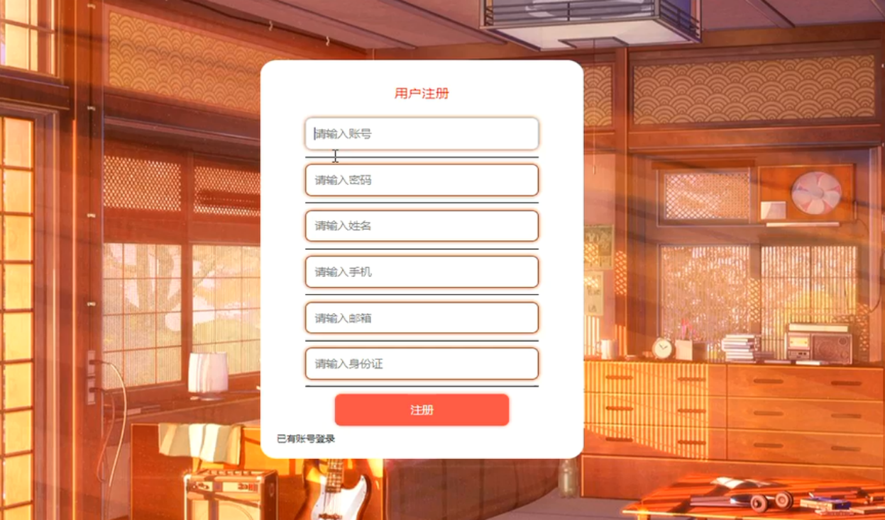

# springboot067-基于SpringBoot的中小型医院网站

>  博主介绍：
>  Hey，我是程序员Chaers，一个专注于计算机领域的程序员
>  十年大厂程序员全栈开发‍ 日常分享项目经验 解决技术难题与技术推荐 承接各类网站设计，小程序开发，毕设等。
>  【计算机专业课程设计，毕业设计项目，Java，微信小程序，安卓APP都可以做，不仅仅是计算机专业，其它专业都可以】

## 3000套系统可挑选，获取链接：https://chaerspol.github.io/

<b>QQ【获取完整源码】：674456564</b>

<b>QQ群【获取完整源码】：1058861570</b>

### 系统架构

> 前端：html | js | css | jquery | vue
>
> 后端：springboot | mybatis
> 
> 环境：jdk1.8+ | mysql | maven

# 一、内容包括
包括有  项目源码+项目论文+数据库源码+答辩ppt+远程调试成功

# 二、运行环境

> jdk版本：1.8 及以上； ide工具：IDEA； 数据库: mysql5.7及以上；编程语言: Java

# 三、需求分析

**3.1 可行性分析**

通过对本基于Spring Boot的中小型医院网站实行的目的初步调查和分析，提出可行性方案并对其一一进行论证。我们在这里主要从技术可行性、操作可行性、经济可行性和时间可行性四方面进行分析。

**3.1.1 技术可行性**

本基于Spring Boot的中小型医院网站采用Java和MYSQL数据库进行开发设计，作为计算机专业学生，在学校期间就接触到许多关于编程方面的知识，当然也包括各种编程软件，对他们的了解度也比较系统，所以技术开发上面还是有一定把握。

**3.1.2 操作可行性**

本人自己就是学生，程序开发经验不足，在界面设计上面不会设计太复杂，要讲究简单好看，操作上要方便，不能让用户觉得不流畅。用户一旦进入操作界面，界面上就会有相应提示，跟着操作提示就可以找到对应的功能操作模块，对于用户来说免培训就能使用。本系统具有易操作、易管理、交互性好的特点，在操作上是非常简单的。因此本系统可以进行开发。

**3.1.3 经济可行性**

由于自己本身就是学生，还没有正式参加工作，金钱上面一直都处于缺乏状态。所以在开发程序过程中，我是不会花太多经济成本在上面的。针对开发软件和数据库，还有界面设计的photoshop软件等在百度上面就可以直接下载，然后根据各种安装视频进行安装，这些资源都是免费的，程序编码阶段使用的源代码在百度上面可以轻松获得，在有网络的环境下就能下载下来，不需要支付任何费用，经济成本很低。

**3.1.4 法律可行性**

开发的基于Spring Boot的中小型医院网站使用的软件和用到的资料来源都是图书馆、百度文库、百度网页等渠道，并不涉及违法。在个人毕业设计上面，无论源代码还是论文编写内容不存在抄袭行为。
综上所述，基于Spring Boot的中小型医院网站在技术、经济、操作和法律上都具有很高的可行性，开发此程序是很必要的。

**3.2 系统性能分析**

（1）系统的存储性：因为是中小型医院网站，所以就会在数据库要求上比较严格，信息录入的比较多，而且丰富复杂， 这就需要一个强大的数据库来存放更多的数据和保证数据的时时性。

（2）系统的易学性：系统设计的应该简单易学的，设计的各种功能应该简单操作，不需要努力学习培训，缩短用户熟悉系统的进程。

（3）系统的数据要求：数据应该录入准确，需要更新时，数据应该可以及时的修改，数据还应该有独立保存，不能删除数据的时候会连带着把还需要的数据都删除掉。

（4）系统稳定性：开发的基于Spring Boot的中小型医院网站要求运行稳定，运行过程中无界面不清楚、字体模糊等现象。

**3.3 角色功能分析**

本基于Spring Boot的中小型医院网站主要满足了三类角色用户的功能需求，包括管理员、医师和用户，下面将对这三类角色用户分别的实现的功能进行阐述。

（1）角色：医师

医师注册登录后主要功能模块包括个人中心、预约挂号管理、体检报告管理、医师开药管理以及用户取药管理。医师用例图如图所示。

（2）角色：管理员
管理员可登录系统后台对系统进行全面管理操作，管理员主要实现等功能模块包括个人中心、用户管理、医师管理、关于我们管理、科室类型管理、门诊信息管理、药库信息管理、缴费清单管理、药品类型管理以及系统管理。管理员实现了对系统信息的添加、修改和删除的功能。管理员用例图如图所示。

（3）角色：用户

用户在系统前台可查看系统信息，包括首页、门诊信息、药库信息、系统公告等，用户要想实现选择门诊预约挂号功能，就必须登录系统，没有账号的用户可首先进行注册操作，注册登录后主要功能模块包括个人中心、预约挂号管理、体检报告管理、医师开药管理、用户取药管理、缴费清单管理。用户用例图如图所示。

# 四、功能模块

在结构设计过程中，首先对系统进行需求分析，然后进行系统初步设计，将系统功能模块细化，具体分析每一个功能模块具体应该首先哪些功能，最后将各个模块进行整合，实现系统结构的最终设计。本基于Spring Boot的中小型医院网站主要实现了用户功能模块、医师功能模块和管理员功能模块三大部分，系统的功能结构设计如图

# 五、效果图展示【部分效果图】

图5-1系统前台主界面图【用户进入本系统可查看系统信息，包括首页、门诊信息、药库信息以及系统公告信息等，系统前台主界面展示如图】

图5-2 用户登录界面图【用户要想实现预约挂号功能，必须登录系统，在登录界面输入正确的登录账号和密码点击登录按钮进行登录，系统会对用户输入的登录信息进行验证，信息正确则登录成功，反之登录失败，用户登录界面展示如图】

图5-3 用户注册界面图【没有账号的用户可进行注册操作，用户注册界面展示如图】

图5-4 门诊信息详情界面图【用户可选择门诊查看详情信息，登录后可进行预约挂号操作，门诊信息详情界面展示如图】

图5-5  预约挂号界面图【用户在预约挂号时需要填写相关数据，预约挂号界面展示如图】

图5-6  药品详情界面图【用户可选择药品查看详情信息，登录后可进行取药操作，药品详情展示如图】

图5-7 用户管理界面图【管理员可增删改查用户信息，用户管理界面展示如图】

图5-8 医师管理界面图【管理员可查看医师信息，并可对其进行修改和删除操作，同时也可添加医师信息，医师管理界面展示如图】

 <b>完整文章</b>
 

 

## 3000套系统可挑选，获取链接：https://chaerspol.github.io/

<b>QQ【获取完整源码】：674456564</b>

<b>QQ群【获取完整源码】：1058861570</b>

